# Semantic Model Storage

## Overview

The GenAI Database Explorer supports multiple storage strategies for semantic models through a flexible persistence layer. This document provides an overview of the available storage options and their capabilities.

## Storage Architecture

The application uses a strategy pattern to support different persistence backends without changing the core application logic. All storage strategies implement the `ISemanticModelPersistenceStrategy` interface, ensuring consistent behavior across different storage types.

```mermaid
graph TB
    A[GenAI Database Explorer] --> B[ISemanticModelPersistenceStrategy]
    B --> C[LocalDiskPersistenceStrategy]
    B --> D[AzureBlobPersistenceStrategy]
    B --> E[CosmosPersistenceStrategy]
    
    C --> F[File System<br/>📁 Local Storage]
    D --> G[Azure Blob Storage<br/>☁️ Cloud Storage]
    E --> H[Azure Cosmos DB<br/>🌐 NoSQL Database]
    
    F --> I[Development<br/>Single User<br/>Local Files]
    G --> J[Production<br/>Scalable<br/>Hierarchical Blobs]
    H --> K[Enterprise<br/>Global Scale<br/>Document Database]
    
    style A fill:#1976d2,color:#fff
    style B fill:#388e3c,color:#fff
    style C fill:#f57c00,color:#fff
    style D fill:#0078d4,color:#fff
    style E fill:#800080,color:#fff
    style F fill:#ffb74d
    style G fill:#42a5f5
    style H fill:#ba68c8
```



### Supported Storage Strategies

1. **Local Disk Storage** - File system-based storage for development and single-user scenarios
2. **Azure Blob Storage** - Cloud storage with hierarchical organization and concurrent operations
3. **Azure Cosmos DB** - NoSQL database storage with global distribution and consistency options

## Storage Strategy Comparison

| Feature | Local Disk | Azure Blob Storage | Azure Cosmos DB |
|---------|------------|-------------------|-----------------|
| **Scalability** | Single machine | High scalability | Global scale |
| **Concurrency** | File locking | High concurrency | Optimistic concurrency |
| **Consistency** | Strong | Eventual | Configurable |
| **Authentication** | File permissions | Azure RBAC | Azure RBAC |
| **Cost** | Storage only | Pay per transaction | Pay per RU + storage |
| **Backup** | Manual | Built-in versioning | Point-in-time restore |
| **Geographic Distribution** | Single location | Multi-region | Global distribution |

## Data Organization

### Semantic Model Structure

Each semantic model consists of:

- **Main Model**: Core metadata including name, source, and description
- **Tables**: Database table definitions with columns and relationships
- **Views**: Database view definitions and dependencies
- **Stored Procedures**: Procedure definitions with parameters and logic

```mermaid
graph TD
    A[Semantic Model] --> B[Main Model]
    A --> C[Tables Collection]
    A --> D[Views Collection]
    A --> E[Stored Procedures Collection]
    
    B --> F[Name<br/>Source<br/>Description<br/>Created Date]
    C --> G[Table 1<br/>• Schema<br/>• Columns<br/>• Relationships]
    C --> H[Table 2<br/>• Schema<br/>• Columns<br/>• Relationships]
    C --> I[...]
    D --> J[View 1<br/>• Schema<br/>• Definition<br/>• Dependencies]
    D --> K[View 2<br/>• Schema<br/>• Definition<br/>• Dependencies]
    E --> L[Procedure 1<br/>• Schema<br/>• Parameters<br/>• Logic]
    E --> M[Procedure 2<br/>• Schema<br/>• Parameters<br/>• Logic]
    
    style A fill:#1976d2,color:#fff
    style B fill:#4caf50,color:#fff
    style C fill:#ff9800,color:#fff
    style D fill:#9c27b0,color:#fff
    style E fill:#f44336,color:#fff
    style F fill:#c8e6c9
    style G fill:#ffe0b2
    style H fill:#ffe0b2
    style J fill:#e1bee7
    style K fill:#e1bee7
    style L fill:#ffcdd2
    style M fill:#ffcdd2
```



### Storage Patterns

#### Local Disk Storage


#### Azure Blob Storage


#### Azure Cosmos DB



```mermaid
graph TD
    A["Database: SemanticModels"] --> B["models Container<br/>(partition key: /modelName)"]
    A --> C["entities Container<br/>(partition key: /modelName)"]
    B --> D["Document: {model-name}<br/>• id: {model-name}<br/>• modelName: {model-name}<br/>• name, source, description<br/>• createdAt: timestamp<br/>• counts: tables, views, procedures<br/>• references: arrays"]
    C --> E["Documents: {model-name}_{entity-type}_{entity-name}<br/>• id: {model-name}_{entity-type}_{entity-name}<br/>• modelName: {model-name}<br/>• entityType: table|view|storedprocedure<br/>• entityName: {entity-name}<br/>• data: {full entity object}<br/>• createdAt: timestamp"]
    
    style A fill:#800080,color:#fff
    style B fill:#0078d4,color:#fff
    style C fill:#0078d4,color:#fff
    style D fill:#e8f5e8
    style E fill:#fff9c4
```

## Security and Authentication

### Authentication Methods

- **Local Disk**: Operating system file permissions
- **Azure Services**: DefaultAzureCredential supporting:
  - Managed Identity (recommended for production)
  - Azure CLI credentials (local development)
  - Visual Studio credentials (local development)
  - Service Principal (automation scenarios)

### Required Permissions

- **Azure Blob Storage**: `Storage Blob Data Contributor` role
- **Azure Cosmos DB**: `Cosmos DB Built-in Data Contributor` role

### Security Features

- Path validation and sanitization for all storage operations
- Entity name sanitization to prevent injection attacks
- Secure credential management through Azure identity services
- Role-based access control (RBAC) for cloud resources

## Performance Characteristics

### Concurrent Operations

All strategies support concurrent operations with configurable limits:

- **Default concurrency**: 10 simultaneous operations
- **Configurable limits**: Adjustable based on requirements and quotas
- **Resource management**: Automatic throttling and retry policies

### Optimization Features

- **Azure Blob Storage**: Parallel uploads/downloads, index blob for fast listing
- **Azure Cosmos DB**: Optimal partition key design, session consistency
- **Local Disk**: Minimal overhead for single-user scenarios

## Configuration

### Strategy Selection

Storage strategy is configured through dependency injection and can be changed without code modifications:

```json
{
  "PersistenceStrategy": "AzureBlobStorage",
  "AzureBlobStorage": {
    "AccountEndpoint": "https://account.blob.core.windows.net/",
    "ContainerName": "semantic-models"
  }
}
```

### Configuration Options

#### Azure Blob Storage

- Account endpoint and container configuration
- Blob prefix for organization
- Operation timeouts and concurrency limits
- Optional customer-managed encryption keys

#### Azure Cosmos DB

- Account endpoint and database configuration
- Container names and partition key paths
- Consistency level selection
- Throughput and retry policy settings

## Error Handling and Resilience

### Exception Management

All strategies provide consistent error handling:

- **Not Found**: When semantic models don't exist
- **Access Denied**: For authentication and authorization failures
- **Rate Limiting**: For cloud service throttling scenarios
- **Network Issues**: For connectivity problems

### Retry Policies

Cloud storage strategies include built-in retry mechanisms:

- **Exponential backoff** for transient failures
- **Configurable retry attempts** for rate limiting
- **Circuit breaker patterns** for sustained failures

## Monitoring and Observability

### Logging

Structured logging is provided for all operations:

- Operation start/completion with timing
- Success and failure tracking
- Performance metrics collection
- Error details with context

### Metrics

Key performance indicators are tracked:

- Operation latency and throughput
- Success/failure rates
- Concurrency utilization
- Storage costs and usage

## Migration and Compatibility

### Strategy Migration

Models can be migrated between storage strategies:

- Export from source strategy
- Import to target strategy
- Validation of data integrity
- Zero-downtime migration support

### Backward Compatibility

All strategies maintain interface compatibility:

- Consistent API across storage types
- No breaking changes to existing code
- Smooth migration paths between versions

## Best Practices

### Development

- Use local disk storage for development and testing
- Configure appropriate timeout values for network operations
- Implement proper error handling for all storage operations

### Production

- Use managed identity authentication for cloud services
- Configure appropriate concurrency limits based on workload
- Monitor storage costs and performance metrics
- Implement backup and disaster recovery procedures

### Security

- Follow principle of least privilege for RBAC assignments
- Use customer-managed keys for sensitive data encryption
- Implement network access restrictions where required
- Regularly audit access patterns and permissions

## Troubleshooting

### Common Issues

1. **Authentication Failures**
   - Verify RBAC role assignments
   - Check DefaultAzureCredential configuration
   - Validate service principal credentials

2. **Performance Issues**
   - Adjust concurrency limits
   - Review timeout configurations
   - Monitor throttling metrics

3. **Data Consistency**
   - Check consistency level settings (Cosmos DB)
   - Verify concurrent operation handling
   - Review retry policy configuration

### Diagnostic Tools

- Application logs with structured data
- Azure portal metrics and diagnostics
- Storage analytics and insights
- Performance profiling tools

This storage architecture provides flexibility, scalability, and security for semantic model persistence while maintaining a consistent programming interface across all storage strategies.
