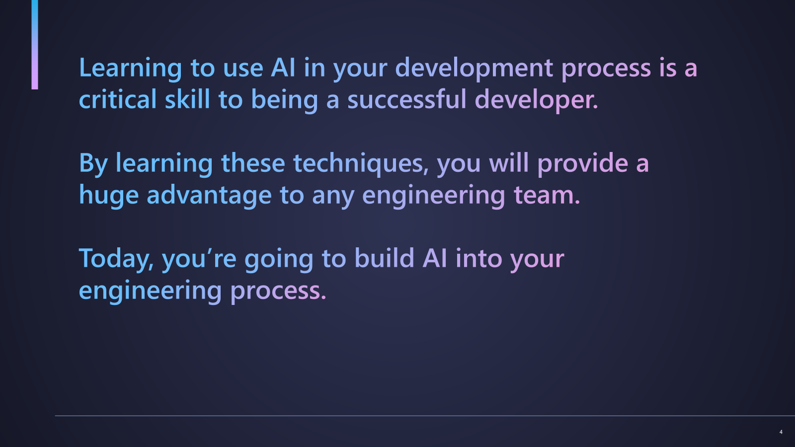

# Workshop Step 1: Reimagining Development with Agentic DevOps (10 minutes) 🚀💡

Welcome to the future of software development! This opening session sets the stage for your AI-powered development journey.

## Learning Objectives 🎯

- ✅ Learn about Agentic DevOps and how AI transforms the development process
- ✅ Understand the fundamentals of GitHub Copilot and AI-assisted development
- ✅ Prepare for the shift from traditional coding to Agentic AI collaboration
- ✅ Prepare to build your own AI-centric engineering process

## Session Overview 📋

This step is primarily a **facilitator-led presentation** covering:

### Part 1: GitHub Copilot Overview (15 minutes)

**Key topics covered in presentation:**

- Goals of the workshop and what you'll learn
- The increasing complexity of Software Development
- Introduction to Agentic DevOps
- What we are going to build together
- What is GitHub Copilot & GitHub Copilot Chat and how does it work?
- The importance of context - Context Engineering
- Customizing Copilot to reimagine your development workflow

## Mental Model Shift 🧠

**From:** Developer as code writer
**To:** Developer as architect, project manager, and AI collaborator

**You will have access to an AI team of:**

- 📋 **Product Manager**: Define product vision, features and requirements
- 🏗️ **Architect**: Design the overall solution and approach
- 💻 **Developer**: Write code with AI assistance, focusing on high-level logic
- 🎨 **UX Designer**: Focus on user experience and interface design
- 🛠️ **Process Owner**: Establish and maintain the development process
- 🎯 **Quality Guardian**: Review, test, and refine AI-generated solutions
- 🤝 **AI Collaborator**: Communicate effectively with AI tools
- 📚 **Documenter**: Maintain clear documentation for AI and human understanding
- 🚀 **SRE**: Ensure reliability and performance of AI-assisted applications
- 🔒 **Security Champion**: Integrate security best practices into AI workflows
- 📊 **Data Scientist**: Analyze data and provide insights for AI models
- ⚙️ **DevOps Engineer**: Automate deployment and operations with AI tools
- And more!

## What's Coming Next 🔄

In the upcoming workshop steps, you'll experience this transformation firsthand:

1. **Step 2**: [Agent Mode & Custom Chat Modes](workshop-step-2-agent-mode-and-custom-chat-modes.md)
1. **Step 3**: [Prompt Files](workshop-step-3-prompt-files.md)
1. **Step 4**: [Building your application with AI](workshop-step-4-build-your-application.md)
1. **Step 5**: [Next Steps](workshop-step-5-next-steps.md)

## Questions for Reflection 🤔

As you move into the hands-on portions, consider:

- How might AI change the way you approach problem-solving?
- What aspects of development do you most want AI to help with?
- How can you leverage AI while maintaining your creative control?
- What new skills do you need to develop for effective AI collaboration?

---

**Ready to dive in?** Let's start building with [Workshop Step 2: Agent Mode & Custom Chat Modes](workshop-step-2-agent-mode-and-custom-chat-modes.md)! 🚀
