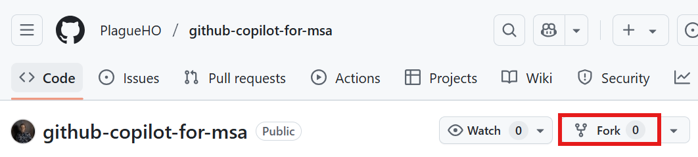
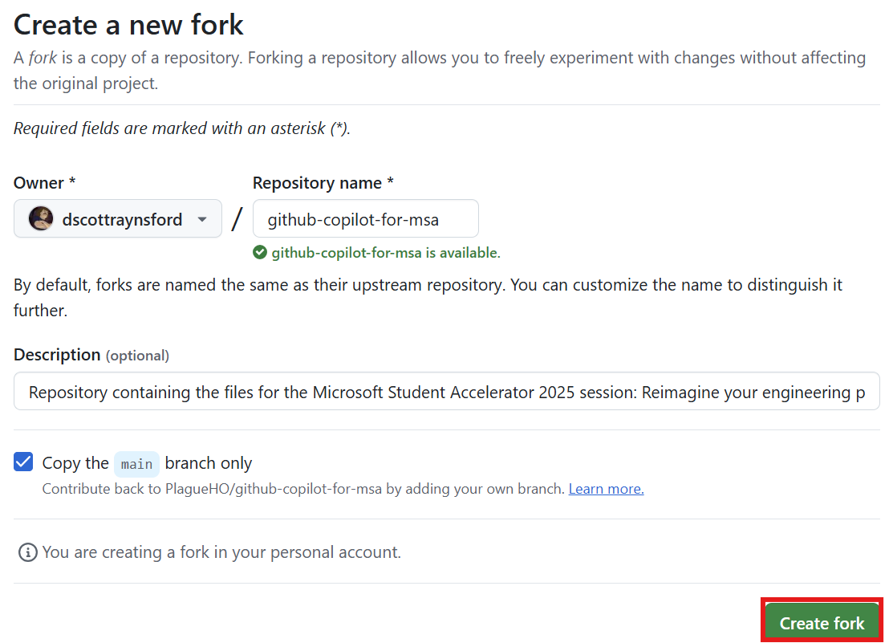
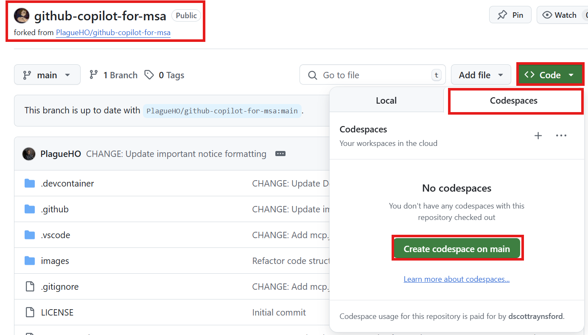

# Workshop Step 2: Agent Mode & Custom Chat Modes (30 minutes) 🤖💬

Learn to collaborate with GitHub Copilot's advanced features to brainstorm and refine your app idea.

## Learning Objectives 🎯

- ✅ Use GitHub Copilot Agent Mode for complex tasks
- ✅ Learn about custom chat modes for specific development tasks
- ✅ Work with custom chat modes (`simple_app_idea_generator` and `mentor`)
- ✅ Develop and refine your application concept
- ✅ Choose an appropriate technology stack

## Part 1: Repository Setup (5 minutes) 🔧

### Step 1: Fork the Repository

1. Navigate to: `https://github.com/PlagueHO/github-copilot-for-msa`
2. Click **Fork** button (top-right corner)

   

3. Select your GitHub account as destination and click **Create fork**

   

### Step 2: Clone Your Fork

1. Open terminal and run (replace `<your-github-username>`):

   ```bash
   gh repo clone <your-github-username>/github-copilot-for-msa
   cd github-copilot-for-msa
   code .
   ```

### Step 2 (Alternative): Use GitHub Codespaces

Alternatively, you can use GitHub Codespaces to run the workshop in your browser by clicking the "Open in Codespaces" button on the repository page. However, this can take a few minutes to set up and so if you have limited time, you may prefer to use the local setup.

1. In your browser, open the page of the GitHub repository for the fork you created in the previous step `https://github.com/<your-github-username>/github-copilot-for-msa`.
1. Click the **Code** button (top-right corner)
1. Click **Codespaces** tab
1. Select **Create codespace on main**

   

1. Wait for Codespace to initialize (this may take a few minutes)
1. 

## Part 2: Understanding Agent Mode (5 minutes) 🕵️‍♂️

**Agent Mode** = AI collaborative partner that can:

- Take autonomous actions to solve complex problems
- Create and modify multiple files simultaneously
- Follow multi-step workflows with context awareness

### Activating Agent Mode

1. Command Palette (`Ctrl+Shift+P` / `Cmd+Shift+P`)
2. Type: "GitHub Copilot: Enable Agent Mode"
3. Or click the agent icon in Copilot Chat panel

> **📸 SCREENSHOT NEEDED**: Command Palette with Agent Mode option highlighted
> **📸 SCREENSHOT NEEDED**: Agent Mode icon in Copilot Chat panel

## Part 3: Working with Custom Chat Modes (10 minutes) 💭

**Custom chat modes** = Specialized AI assistants for specific development tasks.

### Available Chat Modes

#### `@simple_app_idea_generator` 💡

- **Purpose**: Brainstorm and develop initial app concepts
- **Use when**: Need creative inspiration or exploring different ideas
- **Provides**: Unique concepts, market considerations, feature suggestions

#### `@mentor` 👨‍🏫

- **Purpose**: Acts as experienced developer mentor
- **Use when**: Need technical guidance or idea refinement
- **Provides**: Feasibility reviews, tech stack suggestions, best practices

### How to Access Chat Modes

1. Open GitHub Copilot Chat panel (left sidebar)
2. Type `@` + chat mode name (e.g., `@simple_app_idea_generator`)
3. Follow prompts and engage in conversation

> **📸 SCREENSHOT NEEDED**: Copilot Chat panel showing @ autocomplete with available chat modes
> **📸 SCREENSHOT NEEDED**: Example conversation with simple_app_idea_generator showing response

## Part 4: Hands-On Exercise - Develop Your App Idea (10 minutes) 🚀

### Exercise 1: Generate Your App Idea (5 minutes)

1. **Open Copilot Chat** and start with the idea generator:

   ```text
   @simple_app_idea_generator
   
   I'm interested in building an app that helps solve everyday problems. 
   I have experience with [mention your languages/frameworks].
   I'm particularly interested in [social networking, productivity, health, education, etc.].
   
   Can you help me brainstorm some unique app ideas?
   ```

2. **Engage actively**:
   - Ask follow-up questions about interesting ideas
   - Request implementation complexity details
   - Explore variations of promising concepts

3. **Document your favorites**:
   - Create `my-app-ideas.md` in project root
   - List top 3 concepts with brief descriptions

> **📸 SCREENSHOT NEEDED**: Active conversation with simple_app_idea_generator showing multiple app suggestions

### Exercise 2: Refine with the Mentor (5 minutes)

1. **Switch to mentor mode**:

   ```text
   @mentor
   
   I've been working with the idea generator and I'm considering these app concepts:
   [paste your top 3 ideas]
   
   Can you help me evaluate these ideas and suggest the best technology stack?
   ```

2. **Key questions to ask**:
   - "Which idea has the best balance of innovation and feasibility?"
   - "What technology stack would you recommend for [chosen idea]?"
   - "What are the main technical challenges I should be aware of?"

3. **Make final decision**:
   - Choose primary app concept
   - Note recommended technology stack
   - Identify 3-5 core features to focus on

> **📸 SCREENSHOT NEEDED**: Mentor chat mode providing technical evaluation and stack recommendations

## Expected Outcomes & Next Steps 📋

**By the end of this step, you should have:**

- [ ] Successfully forked and cloned the repository
- [ ] Understanding of Agent Mode capabilities
- [ ] Experience with custom chat modes
- [ ] Well-defined app concept with technology stack
- [ ] 3-5 core features identified

**Quick Troubleshooting:**

- **Chat modes not responding?** → Ensure Copilot Chat extension is enabled and you're signed into GitHub
- **Getting generic responses?** → Provide more specific context about your goals and experience
- **Overwhelmed by suggestions?** → Focus on one idea at a time, ask mentor to prioritize

---

**Ready for the next step?** Proceed to [Workshop Step 3: Prompt Files](workshop-step-3-prompt-files.md) to create your detailed app specification! 🚀
