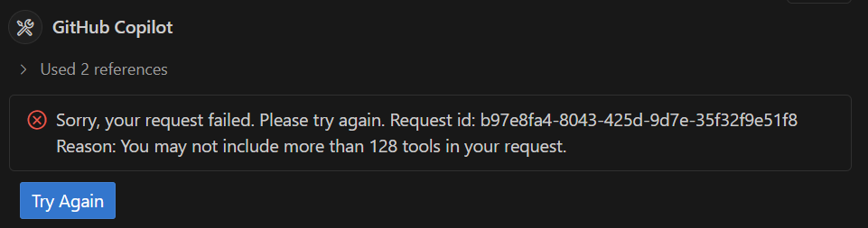
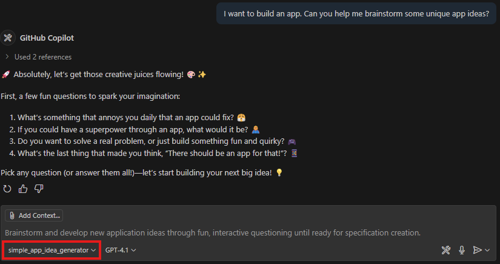
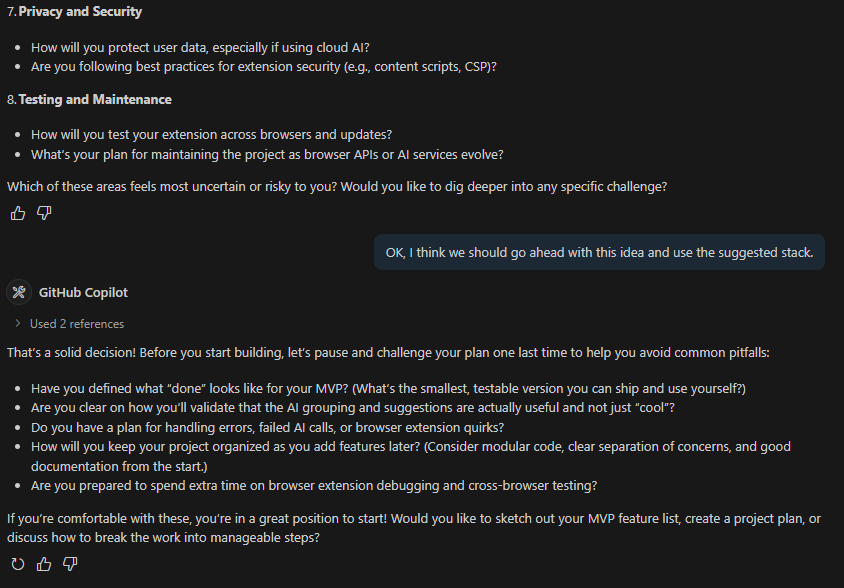

# Workshop Step 2: Agent Mode & Custom Chat Modes (25 minutes) 🤖💬

Learn to collaborate with GitHub Copilot's advanced features to brainstorm and refine your app idea.

## Learning Objectives 🎯

- ✅ Use GitHub Copilot Agent Mode for complex tasks
- ✅ Learn about custom chat modes for specific development tasks
- ✅ Work with custom chat modes (`simple_app_idea_generator` and `mentor`)
- ✅ Develop and refine your application concept
- ✅ Choose an appropriate technology stack

## Part 1: Repository Setup (5 minutes) 🔧

### Step 1: Fork the Repository

1. Navigate to: `https://github.com/PlagueHO/github-copilot-for-msa`
2. Click **Fork** button (top-right corner)

   

3. Select your GitHub account as destination and click **Create fork**

   

### Step 2 (Recommended): Clone Your Fork

1. Open terminal and run (replace `<your-github-username>`):

   ```bash
   gh repo clone <your-github-username>/github-copilot-for-msa
   cd github-copilot-for-msa
   code .
   ```

### Step 2 (Alternative): Use GitHub Codespaces

Alternatively, you can use GitHub Codespaces to run the workshop in your browser by clicking the "Open in Codespaces" button on the repository page. However, this can take a few minutes to set up and so if you have limited time, you may prefer to use the local setup.

1. In your browser, open the page of the GitHub repository for the fork you created in the previous step `https://github.com/<your-github-username>/github-copilot-for-msa`.
1. Click the **Code** button (top-right corner)
1. Click **Codespaces** tab
1. Select **Create codespace on main**

   

1. Wait for Codespace to initialize (this may take a few minutes)

## Part 2: Understanding Agent Mode and setting up tools (5 minutes) 🕵️‍♂️

**Agent Mode** = AI collaborative partner that can:

- Take autonomous actions to solve complex problems
- Use Model Context Protocol (MCP) to call tools and request information
- Create and modify multiple files simultaneously
- Follow multi-step workflows with context awareness

### Activating Agent Mode

1. Open GitHub Copilot Chat (`Ctrl+Shift+I` / `Cmd+Shift+I`)
1. Select **Agent** in the Copilot Chat panel

    

1. Click the **Configure Tools** button to see the tools available to the agent

   

1. Look through a few of the tools to see what is available.

> [!NOTE]
> Only 128 tools can be used at a time. If you have more than 128 tools ticked, you will need to remove some of them before you can use Agent Mode. Just turn off any but the `built-in` sections for now.
>
> You will see this error message if you try to use Agent Mode with too many tools selected:
> 

1. Enter your first agent prompt:

   ```text
   I'm just about to start working through Step 2 of the workshop in this repo. What will I be doing next?
   ```

   The agent will scan through the files in your repository and tell you what it determines you will be doing next. If you want to `steer` the agent, you can provide more context in your prompt, such as using the #file tag to specify a particular file you want it to look at:

   ```text
   I'm just about to start working through #file:workshop-step-2-agent-mode-and-custom-chat-modes.md of the workshop in this repo. What will I be doing next?
   ```

   

## Part 3: Working with Custom Chat Modes (5 minutes) 💭

**Custom chat modes** = Specialized AI assistants for specific development tasks that you can create to provide built-in context and instructions for the AI.

> [!NOTE]
> Custom chat modes are just markdown files that contain instructions, behaviours and built-in context for the AI that you can download or create.

### Use these Chat Modes

#### `simple_app_idea_generator` 💡

- **Purpose**: Brainstorm and develop initial app concepts
- **Use when**: Need creative inspiration or exploring different ideas
- **Provides**: Unique concepts, market considerations, feature suggestions

[Click here to see how the simple_app_idea_generator chat mode is structured](.github/chatmodes/simple_app_idea_generator.chatmode.md)

#### `mentor` 👨‍🏫

- **Purpose**: Acts as experienced developer mentor
- **Use when**: Need technical guidance or idea refinement
- **Provides**: Feasibility reviews, tech stack suggestions, best practices

[Click here to see how the mentor chat mode is structured](.github/chatmodes/mentor.chatmode.md)

#### Other Useful Chat Modes

There are lot more you could try out beyond these examples. Check out:

- [critical_thinking](.github/chatmodes/critical_thinking.chatmode.md) to challenge your thinking and assumptions
- [azure_principal_architect](.github/chatmodes/azure_principal_architect.chatmode.md) to get expert architectural guidance for Azure solutions
- [principal_software_engineer](.github/chatmodes/principal_software_engineer.chatmode.md) to get expert software engineering guidance

You can also create your own custom chat modes by creating a `*.chatmode.md` markdown file in the [.github/chatmodes/](.github/chatmodes/) directory of your repository. See the [Custom Chat Modes documentation](https://code.visualstudio.com/docs/copilot/chat/chat-modes#_custom-chat-mode) for more details on how to create your own custom chat modes.

### How to Access a Custom Chat Mode

1. Open GitHub Copilot Chat (`Ctrl+Shift+I` / `Cmd+Shift+I`)
1. Click the **Agent** drop down and select `simple_app_idea_generator`

   

1. Enter your prompt to start brainstorming app ideas (add any additional context you'd like to provide):

   ```text
   I want to build an app. Can you help me brainstorm some unique app ideas?
   ```

   

1. The agent will start asking questions to gather more context about your interests, skills, and goals. Answer these questions to help it generate better ideas.
1. When it has enough information, it will say:

   ```text
   🎉 OK! We’ve got enough to build a specification and get started! 🎉
   ```

## Part 4: Hands-On Exercise - Develop Your App Idea (10 minutes) 🚀

### Exercise 1: Generate Your App Idea

1. Open Copilot Chat (`Ctrl+Shift+I` / `Cmd+Shift+I`)
1. Click the **Agent** drop down and select `simple_app_idea_generator`:

   ```text
   I'm interested in building an app that helps solve everyday problems. 
   I have experience with [mention your languages/frameworks].
   I'm particularly interested in [social networking, productivity, health, education, etc.].
   
   Can you help me brainstorm some unique app ideas?
   ```

1. **Engage actively**:
   - Ask follow-up questions about interesting ideas
   - Request implementation complexity details
   - Explore variations of promising concepts

1. Once the agent has enough information for your idea it will show:

   ```text
   🎉 OK! We’ve got enough to build a specification and get started! 🎉
   ```

   

Congratulations! You're now ready to check your idea with the mentor!

### Exercise 2: Refine with the Mentor

1. Click the **Agent** drop down and select `mentor`:

   ```text
   I've been working with the idea generator and I've come up with an app idea that I think is unique and interesting and want to build.
   ```

1. **Key questions to ask**:
   - "What do you think about this idea?"
   - "What technology stack would you recommend?"
   - "What are the main technical challenges I should be aware of?"

1. **Make final decision**:
   - "OK, I think we should go ahead with this idea and use the suggested stack."

]

**CONGRATULATIONS!** 🎉 You have successfully brainstormed and refined your app idea using GitHub Copilot's Agent Mode and custom chat modes. You're now ready to turn it into a specification!

## Expected Outcomes & Next Steps 📋

**By the end of this step, you should have:**

- [ ] Successfully forked and cloned the repository
- [ ] Understanding of Agent Mode capabilities
- [ ] Experience with custom chat modes
- [ ] Well-defined app concept with technology stack

**Quick Troubleshooting:**

- **Can't think of an app idea?** → Try one of these apps (web based, mobile, or desktop):
  - Pet adoption app
  - Bookmark manager
  - Local event finder
  - Recipe organizer
  - Fitness challenge app
  - A game
- **Getting generic responses?** → Provide more specific context about your goals and experience. Be explicit about what you want to achieve.
- **Overwhelmed by suggestions?** → Focus on one idea at a time, ask mentor to prioritize.

---

**Ready for the next step?** Proceed to [Workshop Step 3: Prompt Files](workshop-step-3-prompt-files.md) to create your detailed app specification! 🚀
