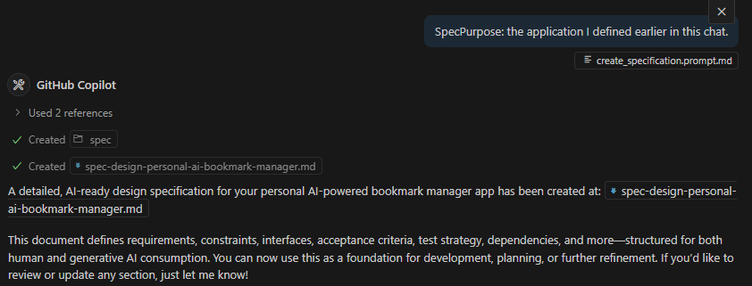
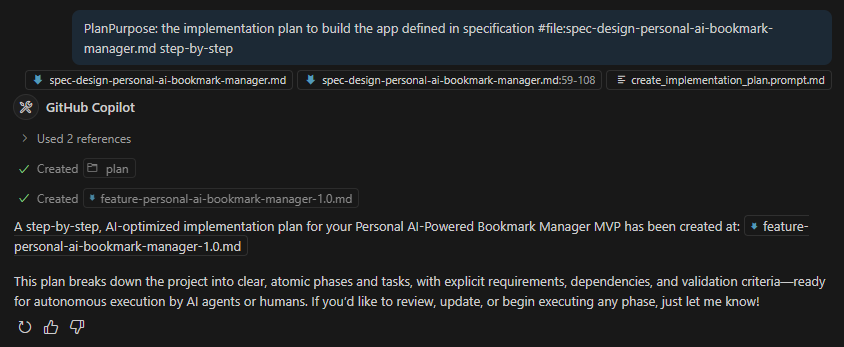
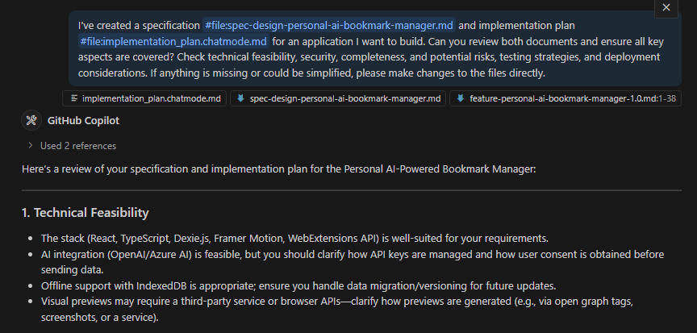

# Workshop Step 3: Prompt Files (20 minutes) 📝✨

Learn to create structured specifications and implementation plans using GitHub Copilot's prompt files.

## Learning Objectives 🎯

- ✅ Understand prompt files and their power for structured AI guidance
- ✅ Create comprehensive app specification using `/create_spec`
- ✅ Develop detailed implementation plan using `/create_implementation_plan`
- ✅ Conduct final review with mentor chat mode

## What Are Prompt Files 🤔

**Prompt files** = Specialized, reusable templates that provide structured AI guidance for specific tasks.

**Benefits:**

- **Consistency**: Every specification follows the same high-quality structure
- **Completeness**: Nothing important gets missed
- **Efficiency**: Faster than manual documentation
- **Professional Quality**: Industry-standard outputs

**How they work:**

1. Invoke with forward slash (e.g., `/create_specification`)
1. Uses the context from your chat session or files in your repository or just the name of the feature you want to create.
1. Iterate and refine the specification or implementation plan as needed

- [Click here to see how the create_specification prompt file is structured](.github/prompts/create_specification.md)
- [Click here to see how the create_implementation_plan prompt file is structured](.github/prompts/create_implementation_plan.md)

You can also create your own prompt files by creating a `*.prompt.md` markdown file in the [.github/prompts/](.github/prompts/) directory of your repository. See the [GitHub Copilot Custom Prompt Files](https://code.visualstudio.com/docs/copilot/copilot-customization#_prompt-files-experimental) for more details on how to create your own custom prompt files.

## Part 1: Available Prompt Files (5 minutes) 📖

- **Specification Generator** (`/create_specification`) - Produces a structured specification file (`spec-[purpose].md`) in the `spec` directory.
- **Implementation Plan Generator** (`/create_implementation_plan`) - Produces a detailed implementation plan file(`*-[purpose].md`) in the `plan` directory based on the specification.

## Part 2: Creating Your App Specification (5 minutes) 📋

1. Open GitHub Copilot Chat (`Ctrl+Shift+I` / `Cmd+Shift+I`)
1. Select the **Agent** drop down and choose `Agent`.
1. Enter your prompt to run the specification generator:

    ```text
    /create_specification SpecPurpose: the application I defined earlier in this chat.
    ```

    

1. After a moment, Copilot will create your specification file in the `spec` directory.
1. Browse to the [spec/](spec/) directory and open the generated file (e.g., `spec-face-link.md`).
1. Review the document and decide if it matches your expectations.
1. If any corrections are needed, ask Copilot to refine specific sections or add missing details - **be specific** in your requests.
1. When you're satisfied, click the `keep` button in the chat window.

    

### Part 3: Create the Implementation Plan (5 minutes)

1. Open GitHub Copilot Chat (`Ctrl+Shift+I` / `Cmd+Shift+I`)
1. Select the **Agent** drop down and choose `Agent`.
1. Enter your prompt to run the implementation plan generator (make sure you use the actual name of the specification file you created in the previous step):

    ```text
    /create_implementation_plan PlanPurpose: the implementation plan to build the app defined in specification #file:spec-face-link.md step-by-step
    ```

    

1. After a moment, Copilot will create your implementation plan in the `plan` directory.
1. Browse to the [plan/](plan/) directory and open the generated file (e.g., `feature-face-link.md`).
1. Review the document and decide if it matches your expectations and clearly defines the steps you need to take to build your application.
1. If any corrections are needed, ask Copilot to refine specific sections or add missing details - **be specific** in your requests.
1. When you're satisfied, click the `keep` button in the chat window.

    

## Part 4: Final Review with Principal Software Engineer (5 minutes) 👨‍🏫

**Engage Principal Software Engineer for comprehensive review:**

1. Open GitHub Copilot Chat (`Ctrl+Shift+I` / `Cmd+Shift+I`)
1. Select the **Agent** drop down and choose `principal_software_engineer`.
1. Enter the following prompt (make sure to correct the file names to match your generated files):

    ```text
    I've created a specification #file:app-specification.md and implementation plan #file:implementation-plan.md for an application I want to build. Can you review both documents and ensure all key aspects are covered? Check technical feasibility, security, completeness, and potential risks, testing strategies, and deployment considerations. If anything is missing or could be simplified, please make changes to the files directly.
    ```

    

1. You may be asked to confirm any changes made to the files. Review these changes carefully and approve them if they align with your expectations.
1. When you're satisfied, click the `keep` button in the chat window.

**CONGRATULATIONS!** 🎉 You have successfully created your application specification and implementation plan and can now hand it to GitHub Copilot Agent to build for you!

## Expected Outcomes & Next Steps 📋

**By the end of this step, you should have:**

- [ ] Complete app specification document (`spec/spec-face-link.md`)
- [ ] Detailed implementation plan (e.g `plan/feature-face-link.md`)  
- [ ] Principal Software Engineer validation of your approach
- [ ] Clear understanding of what you'll build
- [ ] Ready-to-execute implementation plan

**Quick Troubleshooting:**

- **Generic/incomplete outputs?** → Provide more specific context, ask targeted follow-up questions
- **Technical concerns?** → Always validate complex decisions with mentor, ask for simpler alternatives
- **A prompt didn't do what you thought** → Tell Copilot to "Please try again, but consider ..." or "Can you do that differently but change ..."to re-run the prompt with the same context.

---

**Ready to build?** Proceed to [Workshop Step 4: Build Your Application](workshop-step-4-build-your-application.md) to see your app come to life! 🚀
