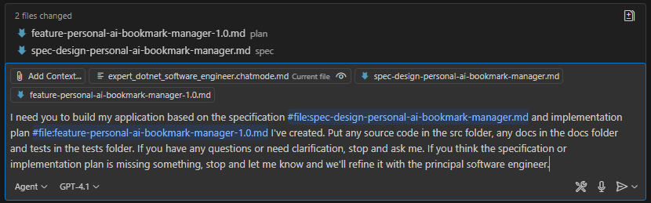
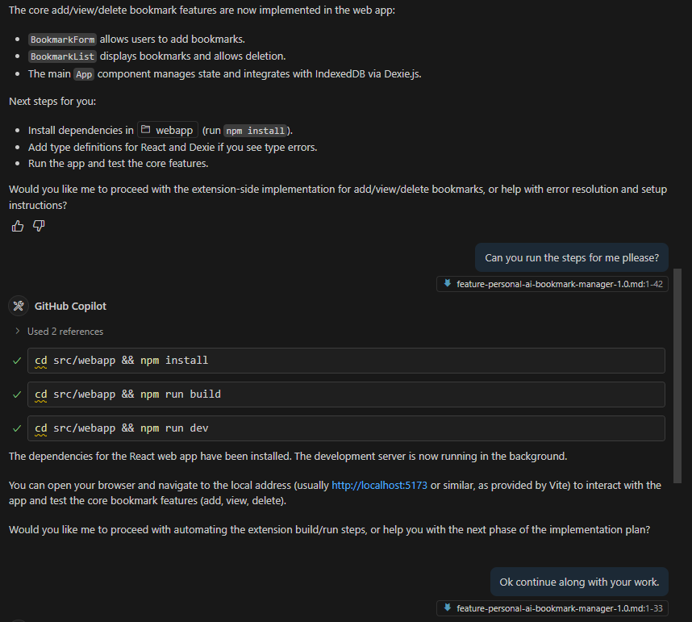

# Workshop Step 4: Build Your Application (15 minutes) 🏗️⚡

Transform your specification and implementation plan into a working application using GitHub Copilot Agent Mode.

## Learning Objectives 🎯

- ✅ Hand off tasks, plans or specifications to GitHub Copilot Agent
- ✅ Guide AI through multi-file application creation  
- ✅ Make real-time adjustments during development
- ✅ Handle common development challenges with AI assistance
- ✅ Have a working prototype of your application

**Key mindset shift:** You're the **architect, product manager and developer**, Copilot is your **full development team**.

## Part 1: Preparing for Agent Mode (3 minutes) 🎬

**Ensure you have:**

- [ ] `spec/spec-face-link.md` - Your detailed app specification
- [ ] `plan/feature-face-link.md` - Your step-by-step development plan
- [ ] Clear understanding of your MVP scope

**Activate Agent Mode:**

1. Open GitHub Copilot Chat (`Ctrl+Shift+I` / `Cmd+Shift+I`)
1. Select the **Agent** drop down and choose `Agent`.

We don't need to use a custom chat mode for this step, but you can if you want to. For example, if you were building an application or feature that used .NET, you could use the `expert_dotnet_software_engineer` chat mode.

## Part 2: Scaffold Your Application (2 minutes) 🛠️

If you want to scaffold your application before handing it off to Copilot, you can use the `#new` Agent tool to create a new repository and set up the initial project structure. But this will require creation of a new workspace and repository - which will not contain your specification or implementation plan files. We'll leave this as an optional step for now, but you can try it out if you want to.

## Part 3: Start Building (5 minutes) 🤝

**Provide complete context to Copilot:**

```markdown
I need you to build my application based on the specification #file:spec-face-link.md and implementation plan #file:plan-feature-face-link.md I've created. If you have any questions or need clarification, stop and ask me. If you think the specification or implementation plan is missing something, stop and let me know and we'll refine it with the principal software engineer. Update the implementation plan as you go along to reflect any changes you make.
```

> [!TIP]
> Being explict about what we want Copilot to do if it has questions or needs clarification is important. This will help us avoid Copilot making assumptions that could lead to incorrect code or missing features. Experiement with different ways of phrasing this to see what works best for you.



Once you press enter, Copilot will start analyzing your files and generating the application structure.

> [!IMPORTANT]
> This process could take several minutes or even hours depending on the complexity of your application and the number of files involved. Copilot might get stuck or loop round trying to fix problems. It may also ask you if it can call tools - review what it is asking and if you are happy with it, then say yes. If you are not happy with it, then say no and ask it to try again.
>
> If Copilot seems to get stuck, click the stop button, provide some direction or clarification, and then ask it continue - it will pick up where it left off because it has the specification and implementation plan context and the history of the conversation.

**Wait for Agent confirmation that includes:**

- ✅ App concept confirmation
- ✅ Core features to implement  
- ✅ Simplified approach for workshop timeline
- ✅ Files it will create


## Part 4: Guide Development Process (7 minutes) 🔧

As the agent works, it will often pause to ask for your input or clarification. This gives you the opportunity to guide the development process and ensure it aligns with your vision.

```text
Yes, please proceed! Start with creating the basic project structure and main interface. 
Focus on getting something running quickly that we can then enhance.
```

**Monitor progress:**

- Watch as Copilot creates multiple files
- Review each file as it's created
- Ask questions if anything is unclear
- Answer any questions it has about the implementation
- Approve or deny tool requests it makes (e.g., run code, install dependencies)

**Test early:**

```text
Can you create a simple way to test this locally? 
What do I need to run to see the app in action?
```



### Part 5: Polishing our app (1 minute)

**Add finishing touches:**

```text
This looks great! Can you add some basic styling to make it look professional. I'd like to use Fluent UI for the styling.
```

## Real-Time Troubleshooting 🔧

**Too complex for timeframe:**

```text
This looks more complex than we need for the workshop. Can you simplify this 
to focus just on [specific core feature]? Let's create something that works 
in our remaining time.
```

**Missing or out of date dependencies:**

```text
I see this needs [library name]. Can you ensure you're using the latest version is 9.3, and here are the docs #fetch <url to docs>.
```

**Need to pivot:**

```text
Given our time constraints, can we pivot to a simpler version that demonstrates 
the core concept? Maybe [suggest simplified approach]?
```

**Tests failing:**

```text
Some of the generated code isn't working as expected. Here is the test output: [paste test output].
```

**Runtime errors:**

```text
I'm getting a runtime error: [paste error message or screenshot]. Can you help diagnose and fix this?
```

**UI Issues:**

```text
The UI isn't rendering correctly. Here is a screenshot of what I'm seeing: [paste screenshot].
Can you help identify the issue and fix it?
```

## Success Metrics & Demo Prep 🎭

**Minimum Viable Demo:**

- [ ] Core concept clearly visible
- [ ] At least one main feature works
- [ ] Can be easily demonstrated to others
- [ ] Shows potential of the full idea

**Demo story structure:**

1. **Set context** (30 seconds): "I built an app that's like Shazam, but for people..."
2. **Show core feature** (1 minute): Demonstrate main functionality
3. **Highlight innovation** (30 seconds): Explain what makes your approach unique
4. **Discuss next steps** (30 seconds): What would you build next?

## Expected Outcomes & Next Steps 📋

**By the end of this step, you should have:**

- [ ] Working application prototype
- [ ] Core feature demonstrating your concept
- [ ] Files organized in logical project structure
- [ ] Clear understanding of how to demo your app
- [ ] Experience collaborating with AI for complex projects

**Immediate next steps:**

Push your work back to your repository:

```bash
git add .
git commit -m "Built MVP with GitHub Copilot Agent Mode"
git push
```

> [!IMPORTANT]
> In the real world, you'd push to a branch and create a pull request for review. For this workshop, we're pushing directly to the main branch to keep things simple.
> You'd also possibly ask the agent to create commits between implementation phases, but for this workshop, we're keeping it simple and just pushing everything at the end.

**Quick Troubleshooting:**

- **Agent Gets Stuck/Loops** → Stop it, give it some instructions, and ask it to continue
- **Package issues?** → Don't rely on Copilot to know every package version, interface or pattern - guide it with specific instructions and use #fetch to provide documentation links
- **Runitme or other errors** → Screenshot/copy the error, paste into Copilot Chat and ask it what might be wrong.

---

**Congratulations!** 🎉 You've experienced the future of software development - from idea to working prototype in 90 minutes using AI as your development partner. This is just the beginning of your AI-powered development journey! 🚀✨
