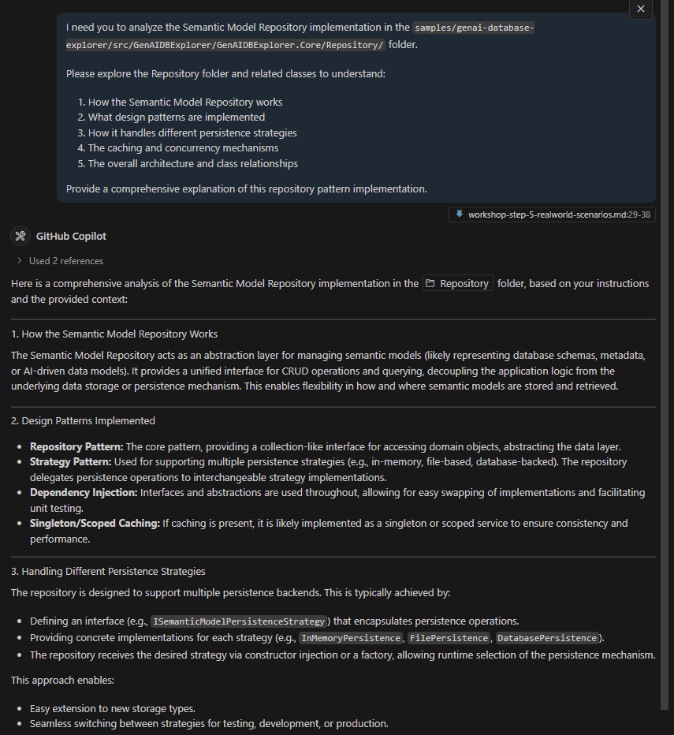
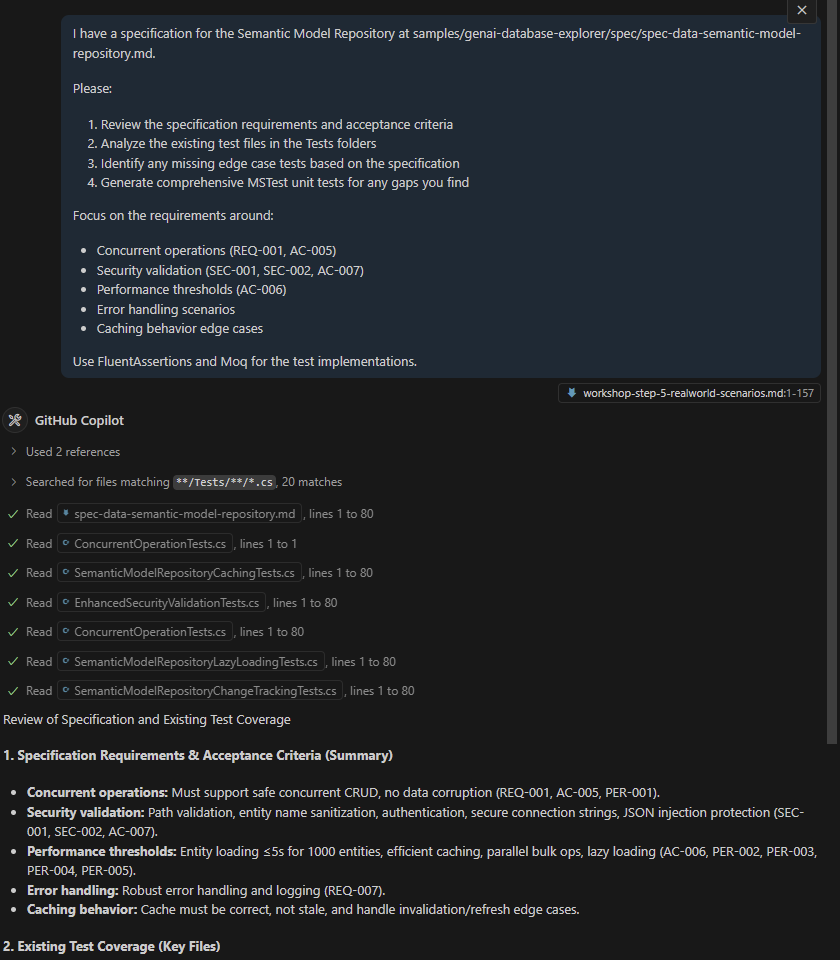
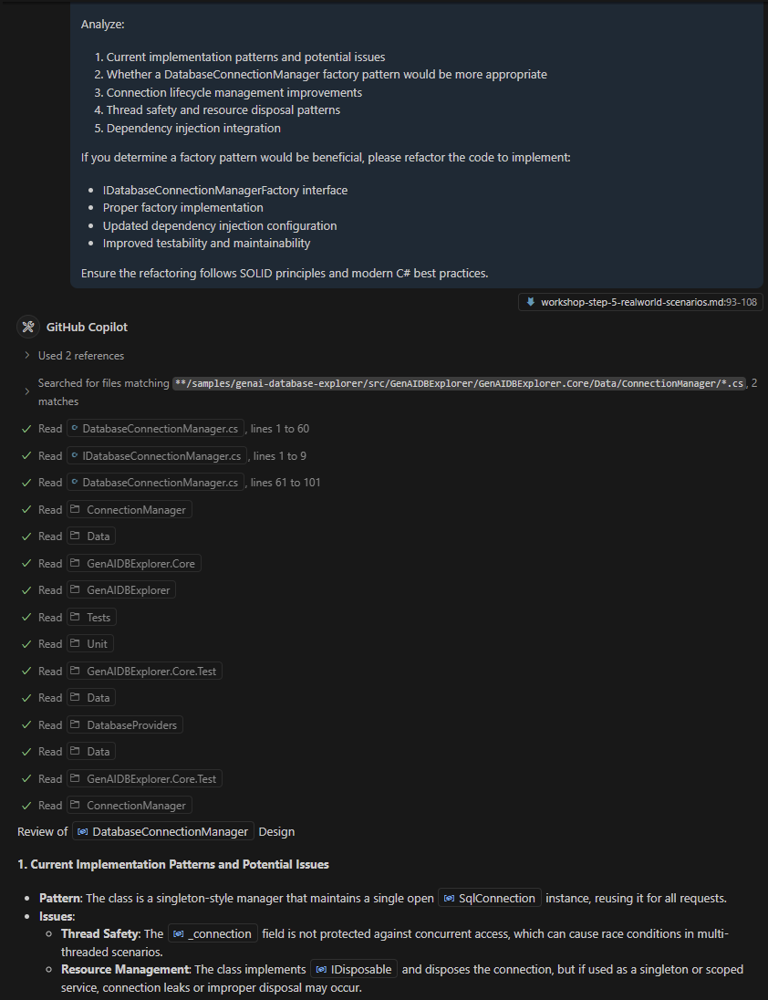

# Workshop Step 5: Real-World Scenarios (20 minutes) 🔍⚙️

Experience GitHub Copilot Agent Mode in realistic development scenarios using the GenAI Database Explorer sample project.

## Learning Objectives 🎯

- ✅ Use GitHub Copilot Agent Mode to analyze and explain complex C# codebases
- ✅ Leverage AI to identify missing test coverage and generate comprehensive edge case tests
- ✅ Apply AI-assisted code review to evaluate and improve design patterns
- ✅ Experience Agent Mode's ability to understand project context and specifications
- ✅ Master Agent Mode workflows for real-world development tasks

**Key mindset shift:** You're the architect directing an AI development team to analyze, test, and improve a complex codebase.

## Workshop Context 📁

All scenarios in this workshop use the **GenAI Database Explorer** sample project located in:
`samples/genai-database-explorer/`

This is a real-world C# .NET application that demonstrates semantic model repository patterns, database connectivity, and AI-driven database exploration. The Agent will analyze this codebase to understand context and provide meaningful insights.

---

## Scenario 1: Code Analysis and Architecture Explanation (7 minutes)

**Activate Agent Mode and provide context:**

```md
I need you to analyze the Semantic Model Repository implementation in the `samples/genai-database-explorer/src/GenAIDBExplorer/GenAIDBExplorer.Core/Repository/` folder.

Please explore the Repository folder and related classes to understand:
1. How the Semantic Model Repository works
2. What design patterns are implemented
3. How it handles different persistence strategies
4. The caching and concurrency mechanisms
5. The overall architecture and class relationships

Provide a comprehensive explanation of this repository pattern implementation.
```

**Expected Agent behavior:**

- Explores the `samples/genai-database-explorer/src/GenAIDBExplorer/GenAIDBExplorer.Core/Repository/` folder
- Analyzes `SemanticModelRepository.cs` and related interfaces
- Understands the Strategy pattern for persistence
- Explains concurrency protection and caching mechanisms
- Provides architectural insights and design pattern identification



---

## Scenario 2: Test Gap Analysis and Edge Case Generation (7 minutes)

**Provide specification context to Agent:**

```md
I have a specification for the Semantic Model Repository at `samples/genai-database-explorer/spec/spec-data-semantic-model-repository.md`.

Please:
1. Review the specification requirements and acceptance criteria
2. Analyze the existing test files in the Tests folders
3. Identify any missing edge case tests based on the specification
4. Generate comprehensive MSTest unit tests for any gaps you find

Focus on the requirements around:
- Concurrent operations (REQ-001, AC-005)
- Security validation (SEC-001, SEC-002, AC-007)
- Performance thresholds (AC-006)
- Error handling scenarios
- Caching behavior edge cases

Use FluentAssertions and Moq for the test implementations.
```

**Expected Agent behavior:**

- Reads and understands the specification document
- Analyzes existing test coverage in test folders
- Identifies specific gaps in edge case testing
- Generates new test methods with proper setup, assertions, and mocking
- Ensures tests align with specification acceptance criteria



---

## Scenario 3: Design Pattern Review and Refactoring (6 minutes)

**Request architectural review:**

```md
Please review the DatabaseConnectionManager in the `samples/genai-database-explorer/src/GenAIDBExplorer/GenAIDBExplorer.Core/Data/ConnectionManager` project and evaluate its current design.

Analyze:
1. Current implementation patterns and potential issues
2. Whether a DatabaseConnectionManager factory pattern would be more appropriate
3. Connection lifecycle management improvements
4. Thread safety and resource disposal patterns
5. Dependency injection integration

If you determine a factory pattern would be beneficial, please refactor the code to implement:
- IDatabaseConnectionManagerFactory interface
- Proper factory implementation
- Updated dependency injection configuration
- Improved testability and maintainability

Ensure the refactoring follows SOLID principles and modern C# best practices.
```

**Expected Agent behavior:**

- Analyzes the current `DatabaseConnectionManager` implementation
- Evaluates design patterns and identifies improvement opportunities
- Determines if factory pattern would be beneficial
- Provides refactored code with factory implementation
- Updates related interfaces and dependency injection setup
- Explains the benefits of the new design



---

## Success Metrics & Next Steps 🎭

**By the end of this workshop, you should have:**

- [ ] Comprehensive understanding of the Semantic Model Repository architecture
- [ ] Identified and addressed test coverage gaps with new edge case tests
- [ ] Evaluated and potentially improved the DatabaseConnectionManager design
- [ ] Experience using Agent Mode for complex codebase analysis
- [ ] Confidence in directing AI agents for real-world development tasks

**Agent Mode Best Practices Learned:**

- Provide sufficient context and specify the folder/project scope
- Reference specification documents for requirement-driven analysis
- Ask for specific deliverables (explanations, tests, refactored code)
- Leverage Agent's ability to understand project structure and relationships
- Use Agent Mode for tasks requiring cross-file analysis and understanding

**Immediate next steps:**

```bash
git add .
git commit -m "Completed real-world scenarios with GitHub Copilot Agent Mode"
git push origin feature/realworld-scenarios
```

---

**Congratulations!** 🎉 You've experienced the power of GitHub Copilot Agent Mode for complex, real-world development scenarios. You're now equipped to leverage AI agents for code analysis, testing, and architectural improvements in your own projects.

---

**Ready for the final step?** Proceed to [Workshop Step 6: Next Steps](workshop-step-6-next-steps.md) to explore your continued learning journey! 🚀
